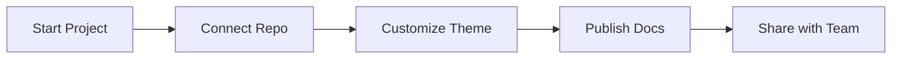

## Overview

Elyan Vadsaria provides a centralized space for your project documentation. You create, organize, and collaborate on docs with version control, search, and customizable themes. Teams use it to maintain living documentation that stays in sync with code repositories.

This platform integrates with GitHub, GitLab, and other tools, ensuring your docs evolve alongside your project. Start by connecting your repo, and watch markdown files transform into polished, searchable pages.

<Callout kind="info">
  Elyan Vadsaria supports MDX for interactive components like tabs and code groups directly in your docs.
</Callout>

## Key Benefits

Organize documentation efficiently with these core advantages:

<Columns cols={3}>
  <Card title="Centralized Hub" icon="database" href="#quick-start">
    Store all project docs in one place. Access APIs, guides, and changelogs instantly.
  </Card>
  <Card title="Team Collaboration" icon="users" href="/quickstart">
    Enable real-time edits, comments, and version history for developers and PMs.
  </Card>
  <Card title="Customizable Themes" icon="palette" href="#brand-guidelines">
    Apply your brand colors like `#3B82F6` for a professional look.
  </Card>
</Columns>

## Quick Start

Get up and running in minutes:

<Steps>
  <Step title="Create Account" icon="user-plus">
    Sign up at `https://elyan-vadsaria.com` with your email or GitHub.
  </Step>
  <Step title="Add Project" icon="plus">
    Connect your repository. Elyan Vadsaria auto-imports markdown files.
  </Step>
  <Step title="Customize" icon="settings">
    Set your brand color to `#3B82F6` in project settings.
  </Step>
  <Step title="Publish" icon="globe">
    Deploy your docs site. Share the live URL with your team.
  </Step>
</Steps>

Here's a sample MDX code block you embed in your docs:

<CodeGroup tabs="JavaScript,Python">
  ```javascript
  // Fetch project docs
  const response = await fetch('https://api.elyan-vadsaria.com/docs/project-id');
  const docs = await response.json();
  console.log(docs);
  ```
  ```python
  # Fetch project docs
  import requests
  response = requests.get('https://api.elyan-vadsaria.com/docs/project-id')
  docs = response.json()
  print(docs)
  ```
</CodeGroup>

## Brand Guidelines

Follow these to maintain consistency:

<Tabs>
  <Tab title="Primary Color" icon="circle">
    Use `#3B82F6` as your main brand color.

    ```css
    :root {
      --brand-primary: #3B82F6;
    }
    ```
  </Tab>
  <Tab title="Typography" icon="font">
    Pair with sans-serif fonts for readability.
  </Tab>
</Tabs>

<Callout kind="tip" default-open="true">
  Always test your theme preview before publishing to ensure `#3B82F6` renders correctly across devices.
</Callout>

## Next Steps

Dive deeper with these guides:

<Columns cols={2}>
  <Card title="Quickstart" icon="zap" href="/quickstart">
    Set up your first project.
  </Card>
  <Card title="Authentication" icon="lock" href="/authentication">
    Secure your docs.
  </Card>
  <Card title="Configuration" icon="settings" href="/configuration">
    Advanced options.
  </Card>
  <Card title="Changelog" icon="git-branch" href="/changelog">
    What's new.
  </Card>
</Columns>

